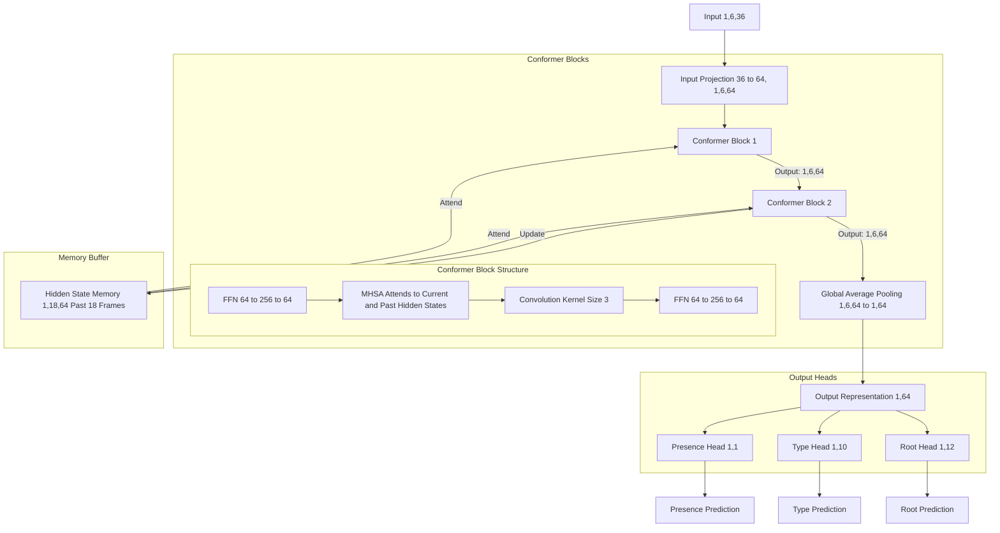

```mermaid
graph TD
    A[Input 1,6,36] --> B[Input Projection 36 to 64, 1,6,64]

    subgraph Conformer Blocks
        B --> C1[Conformer Block 1]
        C1 -->|Output: 1,6,64| C2[Conformer Block 2]
        C2 -->|Output: 1,6,64| D

        subgraph Conformer Block Structure
            C1S[FFN 64 to 256 to 64] --> C1M[MHSA Attends to Current and Past Hidden States]
            C1M --> C1C[Convolution Kernel Size 3]
            C1C --> C1F[FFN 64 to 256 to 64]
        end
    end

    D[Global Average Pooling 1,6,64 to 1,64] --> E[Output Representation 1,64]

    subgraph Output Heads
        E --> F1[Root Head 1,12]
        E --> F2[Type Head 1,10]
        E --> F3[Presence Head 1,1]
    end

    subgraph Memory Buffer
        C2 -->|Update| G[Hidden State Memory 1,18,64 Past 18 Frames]
        G -->|Attend| C1
        G -->|Attend| C2
    end

    F1 --> H1[Root Prediction]
    F2 --> H2[Type Prediction]
    F3 --> H3[Presence Prediction]
```
