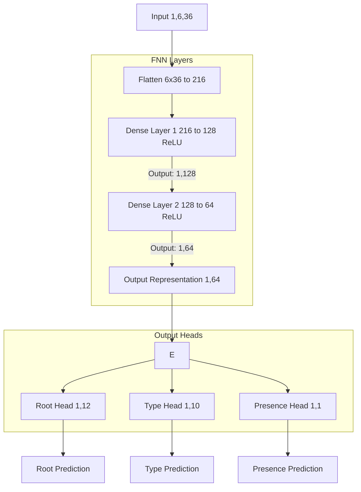

```mermaid
graph TD
    A[Input 1,6,36] --> B[Flatten 6x36 to 216]

    subgraph FNN Layers
        B --> C1[Dense Layer 1 216 to 128 ReLU]
        C1 -->|Output: 1,128| C2[Dense Layer 2 128 to 64 ReLU]
        C2 -->|Output: 1,64| D
    end

    D[Output Representation 1,64] --> E

    subgraph Output Heads
        E --> F1[Root Head 1,12]
        E --> F2[Type Head 1,10]
        E --> F3[Presence Head 1,1]
    end

    F1 --> H1[Root Prediction]
    F2 --> H2[Type Prediction]
    F3 --> H3[Presence Prediction]
```
